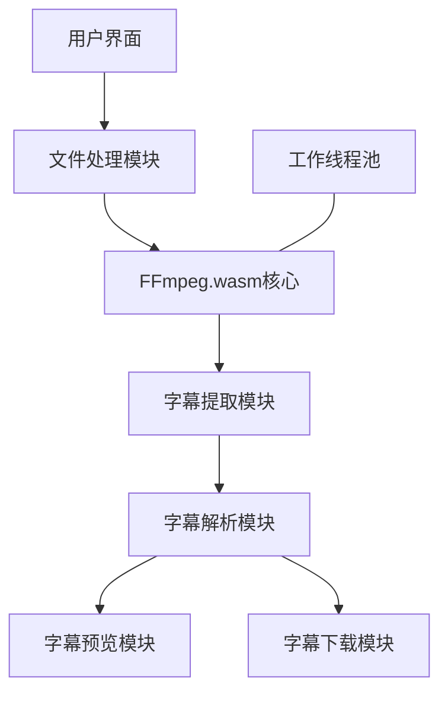
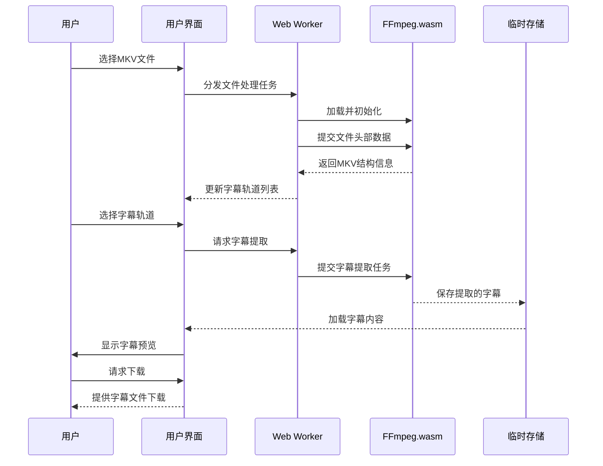

# MKV字幕提取工具实施计划

## 项目概述

这是一个基于浏览器的MKV字幕提取工具，具有以下主要功能：

1. 在浏览器内运行，无需安装额外软件
2. 读取MKV文件（支持处理大文件，从几百MB到10GB+）
3. 列出MKV文件中包含的字幕轨道
4. 提取SRT和ASS格式的字幕文件
5. 预览字幕内容

## 技术架构

### 核心技术栈

- **前端基础**：HTML5 + CSS3 + JavaScript (ES6+)
- **编译打包**：Webpack + Babel
- **核心功能**：FFmpeg.wasm（浏览器中的FFmpeg实现）
- **文件处理**：File API + Web Workers + Streams API
- **字幕解析**：自定义解析器和第三方库

### 系统架构图



### 处理大文件的策略



## 项目结构

```
srt-tools/
│
├── index.html           # 主页面
├── favicon.ico          # 网站图标
├── manifest.json        # PWA清单
│
├── css/                 # 样式文件
│   └── styles.css       # 主样式
│
├── js/                  # JavaScript文件
│   ├── app.js           # 应用主逻辑
│   ├── ui.js            # 用户界面控制
│   ├── file-handler.js  # 文件处理逻辑
│   ├── ffmpeg-core.js   # FFmpeg.wasm核心封装
│   ├── subtitle-parser.js # 字幕解析
│   └── utils.js         # 工具函数
│
├── workers/             # Web Workers
│   ├── ffmpeg-worker.js # FFmpeg处理工作线程
│   └── parse-worker.js  # 解析工作线程
│
└── libs/                # 第三方库
    ├── ffmpeg-wasm/     # FFmpeg.wasm库
    └── subtitle-libs/   # 字幕处理相关库
```

## 开发环境设置

### 项目初始化

```bash
# 创建项目目录
mkdir -p srt-tools/js srt-tools/css srt-tools/workers srt-tools/libs

# 初始化npm项目
cd srt-tools
npm init -y

# 安装核心依赖
npm install @ffmpeg/ffmpeg @ffmpeg/core subtitle
npm install --save-dev webpack webpack-cli webpack-dev-server babel-loader @babel/core @babel/preset-env
```

### Webpack配置文件

```javascript
// webpack.config.js
const path = require('path');

module.exports = {
  mode: 'development',
  entry: './js/app.js',
  output: {
    filename: 'bundle.js',
    path: path.resolve(__dirname, 'dist'),
  },
  devServer: {
    static: {
      directory: path.join(__dirname, '/'),
    },
    headers: {
      'Cross-Origin-Opener-Policy': 'same-origin',
      'Cross-Origin-Embedder-Policy': 'require-corp',
    }
  },
  module: {
    rules: [
      {
        test: /\.js$/,
        exclude: /node_modules/,
        use: {
          loader: 'babel-loader',
          options: {
            presets: ['@babel/preset-env']
          }
        }
      }
    ]
  }
};
```

### package.json 配置

```json
{
  "name": "srt-tools",
  "version": "1.0.0",
  "description": "MKV字幕提取工具",
  "main": "js/app.js",
  "scripts": {
    "dev": "webpack serve --open",
    "build": "webpack --mode production"
  },
  "keywords": [
    "mkv",
    "subtitle",
    "ffmpeg",
    "wasm"
  ],
  "author": "",
  "license": "MIT",
  "dependencies": {
    "@ffmpeg/core": "^0.11.0",
    "@ffmpeg/ffmpeg": "^0.11.0",
    "subtitle": "^4.0.1"
  },
  "devDependencies": {
    "@babel/core": "^7.17.5",
    "@babel/preset-env": "^7.16.11",
    "babel-loader": "^8.2.3",
    "webpack": "^5.76.0",
    "webpack-cli": "^4.9.2",
    "webpack-dev-server": "^4.7.4"
  }
}
```

## 核心模块实现

### 1. 主页面 (index.html)

```html
<!DOCTYPE html>
<html lang="zh-CN">
<head>
  <meta charset="UTF-8">
  <meta name="viewport" content="width=device-width, initial-scale=1.0">
  <title>MKV字幕提取工具</title>
  <link rel="stylesheet" href="css/styles.css">
</head>
<body>
  <div class="container">
    <header>
      <h1>MKV字幕提取工具</h1>
      <p>一个在浏览器中运行的MKV字幕提取和预览工具</p>
    </header>
    
    <main>
      <!-- 应用加载指示器 -->
      <div id="app-loading" class="loading-container">
        <div class="loading-spinner"></div>
        <div class="loading-text">正在初始化应用...</div>
      </div>
      
      <!-- 文件选择区域 -->
      <div id="file-select-container" class="section" style="display: none;">
        <h2>选择MKV文件</h2>
        <div id="drop-zone" class="drop-zone">
          <div class="drop-icon">📁</div>
          <p>将MKV文件拖放到此处，或点击选择文件</p>
          <input type="file" id="file-input" accept=".mkv" style="display: none;">
        </div>
      </div>
      
      <!-- FFmpeg加载指示器 -->
      <div id="ffmpeg-loading" class="loading-container" style="display: none;">
        <div class="loading-spinner"></div>
        <div class="loading-text">正在加载处理引擎...</div>
        <div class="loading-subtext">初次加载可能需要几分钟，请耐心等待</div>
      </div>
      
      <!-- 文件信息区域 -->
      <div id="file-info-container" class="section" style="display: none;">
        <h2>文件信息</h2>
        <div id="file-info"></div>
      </div>
      
      <!-- 通用加载指示器 -->
      <div id="loading-indicator" class="loading-container" style="display: none;">
        <div class="loading-spinner"></div>
        <div class="loading-text">处理中...</div>
        <progress id="progress-bar" value="0" max="100"></progress>
        <div id="progress-text">0%</div>
      </div>
      
      <!-- 错误信息区域 -->
      <div id="error-container" class="error-container" style="display: none;">
        <div id="error-message"></div>
      </div>
      
      <!-- 字幕轨道列表 -->
      <div id="subtitle-tracks-container" class="section" style="display: none;">
        <h2>字幕轨道</h2>
        <div id="subtitle-track-list"></div>
        
        <div class="action-buttons">
          <button id="preview-button" class="button">预览字幕</button>
          <button id="extract-button" class="button primary">提取并下载</button>
        </div>
      </div>
      
      <!-- 字幕预览区域 -->
      <div id="subtitle-preview-container" class="section" style="display: none;">
        <h2>字幕预览</h2>
        <div id="subtitle-preview" class="subtitle-preview"></div>
      </div>
    </main>
    
    <footer>
      <p>MKV字幕提取工具 - 基于WebAssembly和FFmpeg技术</p>
    </footer>
  </div>
  
  <script src="dist/bundle.js"></script>
</body>
</html>
```

### 2. CSS样式 (styles.css)

```css
/* css/styles.css */
:root {
  --primary-color: #4a6baf;
  --secondary-color: #e9ecef;
  --text-color: #333;
  --light-text: #666;
  --highlight-color: #5f7ed7;
  --border-color: #ddd;
  --background-color: #f8f9fa;
  --error-color: #d9534f;
}

* {
  box-sizing: border-box;
  margin: 0;
  padding: 0;
}

body {
  font-family: -apple-system, BlinkMacSystemFont, "Segoe UI", Roboto, "Helvetica Neue", Arial, sans-serif;
  line-height: 1.6;
  color: var(--text-color);
  background-color: #fff;
  padding: 20px;
}

.container {
  max-width: 800px;
  margin: 0 auto;
  background-color: #fff;
  border-radius: 8px;
  box-shadow: 0 2px 10px rgba(0, 0, 0, 0.1);
  overflow: hidden;
}

header {
  background-color: var(--primary-color);
  color: white;
  padding: 20px;
  text-align: center;
}

header h1 {
  margin-bottom: 10px;
  font-size: 24px;
}

header p {
  opacity: 0.9;
  font-size: 14px;
}

main {
  padding: 20px;
}

.section {
  margin-bottom: 30px;
  padding: 20px;
  background-color: var(--background-color);
  border-radius: 6px;
}

.section h2 {
  margin-bottom: 15px;
  font-size: 18px;
  color: var(--primary-color);
}

/* 文件拖放区域 */
.drop-zone {
  border: 2px dashed var(--border-color);
  border-radius: 6px;
  padding: 40px 20px;
  text-align: center;
  background-color: white;
  cursor: pointer;
  transition: all 0.3s ease;
}

.drop-zone:hover, .drop-zone.drag-over {
  border-color: var(--highlight-color);
  background-color: rgba(95, 126, 215, 0.05);
}

.drop-icon {
  font-size: 48px;
  margin-bottom: 10px;
  color: var(--light-text);
}

/* 加载指示器 */
.loading-container {
  text-align: center;
  padding: 20px;
}

.loading-spinner {
  border: 3px solid rgba(0, 0, 0, 0.1);
  border-top: 3px solid var(--primary-color);
  border-radius: 50%;
  width: 40px;
  height: 40px;
  animation: spin 1s linear infinite;
  margin: 0 auto 15px;
}

@keyframes spin {
  0% { transform: rotate(0deg); }
  100% { transform: rotate(360deg); }
}

.loading-text {
  margin-bottom: 5px;
  font-weight: bold;
}

.loading-subtext {
  font-size: 14px;
  color: var(--light-text);
}

/* 进度条 */
progress {
  width: 100%;
  height: 12px;
  margin: 10px 0;
  border-radius: 6px;
  appearance: none;
  overflow: hidden;
}

progress::-webkit-progress-bar {
  background-color: var(--secondary-color);
  border-radius: 6px;
}

progress::-webkit-progress-value {
  background-color: var(--primary-color);
  border-radius: 6px;
}

#progress-text {
  font-size: 14px;
  color: var(--light-text);
}

/* 错误信息 */
.error-container {
  background-color: #fbeaea;
  border: 1px solid var(--error-color);
  color: var(--error-color);
  padding: 10px 15px;
  border-radius: 4px;
  margin-bottom: 20px;
  text-align: center;
}

/* 字幕轨道列表 */
.track-item {
  padding: 10px 15px;
  margin-bottom: 5px;
  background-color: white;
  border-radius: 4px;
  border: 1px solid var(--border-color);
  display: flex;
  align-items: center;
}

.track-item input[type="radio"] {
  margin-right: 10px;
}

/* 按钮样式 */
.action-buttons {
  display: flex;
  gap: 10px;
  margin-top: 20px;
}

.button {
  padding: 10px 20px;
  border: none;
  border-radius: 4px;
  background-color: var(--secondary-color);
  color: var(--text-color);
  cursor: pointer;
  font-size: 14px;
  transition: all 0.2s ease;
}

.button:hover {
  background-color: #dfe3e8;
}

.button.primary {
  background-color: var(--primary-color);
  color: white;
}

.button.primary:hover {
  background-color: var(--highlight-color);
}

/* 字幕预览 */
.subtitle-preview {
  max-height: 400px;
  overflow-y: auto;
  background-color: white;
  border: 1px solid var(--border-color);
  border-radius: 4px;
  padding: 10px;
}

.subtitle-entry {
  padding: 8px 0;
  border-bottom: 1px solid var(--secondary-color);
}

.subtitle-entry:last-child {
  border-bottom: none;
}

.time-code {
  font-size: 12px;
  color: var(--light-text);
  margin-bottom: 5px;
  font-family: monospace;
}

.subtitle-text {
  white-space: pre-wrap;
}

.more-subtitles {
  text-align: center;
  padding: 10px;
  font-style: italic;
  color: var(--light-text);
}

/* 底部区域 */
footer {
  text-align: center;
  padding: 15px;
  border-top: 1px solid var(--border-color);
  font-size: 12px;
  color: var(--light-text);
}

/* 响应式设计 */
@media (max-width: 600px) {
  body {
    padding: 10px;
  }
  
  .container {
    box-shadow: none;
  }
  
  .action-buttons {
    flex-direction: column;
  }
  
  .button {
    width: 100%;
  }
}
```

### 3. 应用主模块 (app.js)

```javascript
// js/app.js
import { setupUI } from './ui.js';
import { initFileHandler } from './file-handler.js';
import { initFFmpeg } from './ffmpeg-core.js';

// 应用初始化
async function initApp() {
  console.log('初始化应用...');
  
  // 设置UI事件监听器
  setupUI();
  
  // 初始化文件处理模块
  initFileHandler();
  
  // 预加载界面就绪
  document.getElementById('app-loading').style.display = 'none';
  document.getElementById('file-select-container').style.display = 'block';
  
  console.log('应用初始化完成，等待用户选择文件...');
}

// 启动应用
document.addEventListener('DOMContentLoaded', initApp);

// 导出应用状态与功能
export const appState = {
  currentFile: null,
  subtitleTracks: [],
  selectedTrack: null,
  ffmpegLoaded: false
};
```

### 4. FFmpeg核心封装 (ffmpeg-core.js)

```javascript
// js/ffmpeg-core.js
import { createFFmpeg } from '@ffmpeg/ffmpeg';
import { appState } from './app.js';

// 创建FFmpeg实例
const ffmpeg = createFFmpeg({
  log: true,
  corePath: 'libs/ffmpeg/ffmpeg-core.js'
});

// 延迟加载标志
let isLoading = false;
let isLoaded = false;

// 初始化FFmpeg
export async function initFFmpeg() {
  if (isLoaded) return true;
  if (isLoading) return false;
  
  try {
    isLoading = true;
    document.getElementById('ffmpeg-loading').style.display = 'block';
    
    console.log('加载FFmpeg...');
    await ffmpeg.load();
    
    console.log('FFmpeg加载完成');
    isLoaded = true;
    isLoading = false;
    appState.ffmpegLoaded = true;
    
    document.getElementById('ffmpeg-loading').style.display = 'none';
    return true;
  } catch (error) {
    console.error('FFmpeg加载失败:', error);
    document.getElementById('ffmpeg-loading').style.display = 'none';
    document.getElementById('error-message').textContent = '加载处理引擎失败，请刷新页面重试。';
    document.getElementById('error-container').style.display = 'block';
    
    isLoading = false;
    return false;
  }
}

// 识别MKV文件中的字幕轨道
export async function identifySubtitleTracks(file) {
  if (!isLoaded) {
    const loaded = await initFFmpeg();
    if (!loaded) return [];
  }
  
  try {
    // 仅读取文件头部进行分析
    const headerBuffer = await readFileChunk(file, 0, Math.min(10 * 1024 * 1024, file.size));
    const headerUint8 = new Uint8Array(headerBuffer);
    
    // 写入FFmpeg虚拟文件系统
    ffmpeg.FS('writeFile', 'input.mkv', headerUint8);
    
    // 使用FFmpeg分析文件
    await ffmpeg.run('-i', 'input.mkv');
    
    // 从FFmpeg日志中提取字幕信息
    const logOutput = ffmpeg.FS('readFile', 'ffmpeg-output.txt');
    const tracks = parseSubtitleTracksFromOutput(new TextDecoder().decode(logOutput));
    
    // 清理临时文件
    ffmpeg.FS('unlink', 'input.mkv');
    ffmpeg.FS('unlink', 'ffmpeg-output.txt');
    
    return tracks;
  } catch (error) {
    console.error('识别字幕轨道失败:', error);
    return [];
  }
}

// 提取字幕
export async function extractSubtitle(file, trackIndex, format = 'srt') {
  if (!isLoaded) {
    const loaded = await initFFmpeg();
    if (!loaded) return null;
  }
  
  try {
    // 为大文件创建Web Worker
    if (file.size > 100 * 1024 * 1024) { // 大于100MB
      return extractWithWorker(file, trackIndex, format);
    }
    
    // 读取整个文件
    const buffer = await file.arrayBuffer();
    const uint8Array = new Uint8Array(buffer);
    
    // 写入FFmpeg虚拟文件系统
    ffmpeg.FS('writeFile', 'input.mkv', uint8Array);
    
    // 提取字幕
    const outputName = `output.${format}`;
    await ffmpeg.run(
      '-i', 'input.mkv',
      '-map', `0:s:${trackIndex}`,
      '-c:s', format === 'ass' ? 'ass' : 'srt',
      outputName
    );
    
    // 读取输出字幕
    const subtitleData = ffmpeg.FS('readFile', outputName);
    
    // 清理临时文件
    ffmpeg.FS('unlink', 'input.mkv');
    ffmpeg.FS('unlink', outputName);
    
    // 转换为文本
    return new TextDecoder().decode(subtitleData);
  } catch (error) {
    console.error('提取字幕失败:', error);
    return null;
  }
}

// 使用Worker处理大文件
async function extractWithWorker(file, trackIndex, format) {
  return new Promise((resolve) => {
    const worker = new Worker('workers/ffmpeg-worker.js');
    
    worker.onmessage = (e) => {
      if (e.data.type === 'complete') {
        resolve(e.data.subtitle);
      } else if (e.data.type === 'progress') {
        updateProgressBar(e.data.progress);
      }
    };
    
    worker.postMessage({
      type: 'extract',
      file,
      trackIndex,
      format
    });
  });
}

// 辅助函数：读取文件的特定部分
async function readFileChunk(file, start, end) {
  const slice = file.slice(start, end);
  return await slice.arrayBuffer();
}

// 辅助函数：从FFmpeg输出解析字幕轨道信息
function parseSubtitleTracksFromOutput(output) {
  const tracks = [];
  const lines = output.split('\n');
  
  for (let i = 0; i < lines.length; i++) {
    const line = lines[i];
    
    // 使用正则表达式匹配字幕轨道信息
    const match = line.match(/Stream #\d+:(\d+)(?:\(([^)]+)\))?: Subtitle: ([^,]+)(.*)/);
    if (match) {
      const trackNumber = parseInt(match[1], 10);
      const language = match[2] || '未知';
      const format = match[3];
      
      tracks.push({
        index: trackNumber,
        language,
        format,
        description: `${language} (${format})`
      });
    }
  }
  
  return tracks;
}

// 更新进度条
function updateProgressBar(progress) {
  const progressBar = document.getElementById('progress-bar');
  const progressText = document.getElementById('progress-text');
  
  if (progressBar && progressText) {
    progressBar.value = progress;
    progressText.textContent = `${Math.round(progress)}%`;
  }
}

// 导出FFmpeg实例以便其他模块使用
export { ffmpeg };
```

### 5. 文件处理模块 (file-handler.js)

```javascript
// js/file-handler.js
import { appState } from './app.js';
import { identifySubtitleTracks } from './ffmpeg-core.js';
import { updateSubtitleTrackList } from './ui.js';

// 初始化文件处理
export function initFileHandler() {
  const fileInput = document.getElementById('file-input');
  const dropZone = document.getElementById('drop-zone');
  
  // 文件选择事件
  fileInput.addEventListener('change', handleFileSelect);
  
  // 文件拖放事件
  dropZone.addEventListener('dragover', (e) => {
    e.preventDefault();
    dropZone.classList.add('drag-over');
  });
  
  dropZone.addEventListener('dragleave', () => {
    dropZone.classList.remove('drag-over');
  });
  
  dropZone.addEventListener('drop', (e) => {
    e.preventDefault();
    dropZone.classList.remove('drag-over');
    
    if (e.dataTransfer.files.length > 0) {
      handleFile(e.dataTransfer.files[0]);
    }
  });
  
  // 点击区域触发文件选择
  dropZone.addEventListener('click', () => {
    fileInput.click();
  });
}

// 处理文件选择事件
function handleFileSelect(e) {
  if (e.target.files.length > 0) {
    handleFile(e.target.files[0]);
  }
}

// 处理选择的文件
export async function handleFile(file) {
  // 检查文件类型
  if (!file.name.toLowerCase().endsWith('.mkv')) {
    showError('请选择MKV格式的文件');
    return;
  }
  
  appState.currentFile = file;
  
  // 显示文件信息
  document.getElementById('file-info').textContent = `文件: ${file.name} (${formatFileSize(file.size)})`;
  document.getElementById('file-info-container').style.display = 'block';
  
  // 显示加载指示器
  document.getElementById('loading-indicator').style.display = 'block';
  
  // 识别字幕轨道
  try {
    const tracks = await identifySubtitleTracks(file);
    appState.subtitleTracks = tracks;
    
    // 更新UI
    updateSubtitleTrackList(tracks);
    
    // 隐藏加载指示器
    document.getElementById('loading-indicator').style.display = 'none';
    
    // 显示字幕轨道列表
    if (tracks.length > 0) {
      document.getElementById('subtitle-tracks-container').style.display = 'block';
    } else {
      showError('未在文件中找到字幕轨道');
    }
  } catch (error) {
    console.error('处理文件出错:', error);
    showError('处理文件时出错，请重试');
    document.getElementById('loading-indicator').style.display = 'none';
  }
}

// 显示错误信息
function showError(message) {
  const errorElement = document.getElementById('error-message');
  errorElement.textContent = message;
  document.getElementById('error-container').style.display = 'block';
  
  // 3秒后自动隐藏
  setTimeout(() => {
    document.getElementById('error-container').style.display = 'none';
  }, 3000);
}

// 格式化文件大小
function formatFileSize(bytes) {
  if (bytes < 1024) return bytes + ' B';
  if (bytes < 1024 * 1024) return (bytes / 1024).toFixed(2) + ' KB';
  if (bytes < 1024 * 1024 * 1024) return (bytes / (1024 * 1024)).toFixed(2) + ' MB';
  return (bytes / (1024 * 1024 * 1024)).toFixed(2) + ' GB';
}
```

### 6. 用户界面模块 (ui.js)

```javascript
// js/ui.js
import { appState } from './app.js';
import { extractSubtitle } from './ffmpeg-core.js';
import { parseSubtitle, renderSubtitlePreview } from './subtitle-parser.js';

// 设置UI事件处理
export function setupUI() {
  // 预览按钮
  document.getElementById('preview-button').addEventListener('click', handlePreviewClick);
  
  // 提取下载按钮
  document.getElementById('extract-button').addEventListener('click', handleExtractClick);
}

// 更新字幕轨道列表
export function updateSubtitleTrackList(tracks) {
  const trackList = document.getElementById('subtitle-track-list');
  trackList.innerHTML = '';
  
  tracks.forEach((track, index) => {
    const trackItem = document.createElement('div');
    trackItem.classList.add('track-item');
    
    const radio = document.createElement('input');
    radio.type = 'radio';
    radio.name = 'subtitle-track';
    radio.id = `track-${index}`;
    radio.value = index;
    
    if (index === 0) {
      radio.checked = true;
      appState.selectedTrack = track;
    }
    
    radio.addEventListener('change', () => {
      appState.selectedTrack = track;
      
      // 清空预览
      document.getElementById('subtitle-preview').innerHTML = '';
      document.getElementById('subtitle-preview-container').style.display = 'none';
    });
    
    const label = document.createElement('label');
    label.htmlFor = `track-${index}`;
    label.textContent = `轨道 ${track.index + 1}: ${track.language} (${track.format})`;
    
    trackItem.appendChild(radio);
    trackItem.appendChild(label);
    trackList.appendChild(trackItem);
  });
  
  // 默认选择第一个轨道
  if (tracks.length > 0) {
    appState.selectedTrack = tracks[0];
  }
}

// 处理预览按钮点击
async function handlePreviewClick() {
  if (!appState.currentFile || !appState.selectedTrack) {
    return;
  }
  
  // 显示加载指示器
  document.getElementById('loading-indicator').style.display = 'block';
  document.getElementById('subtitle-preview-container').style.display = 'none';
  
  try {
    // 提取字幕内容
    const format = appState.selectedTrack.format.toLowerCase();
    const preferredFormat = (format === 'ass' || format === 'ssa') ? 'ass' : 'srt';
    
    const subtitleContent = await extractSubtitle(
      appState.currentFile,
      appState.selectedTrack.index,
      preferredFormat
    );
    
    if (!subtitleContent) {
      throw new Error('无法提取字幕内容');
    }
    
    // 解析字幕
    const parsedSubtitle = parseSubtitle(subtitleContent, preferredFormat);
    
    // 显示预览
    renderSubtitlePreview(parsedSubtitle);
    
    // 显示预览容器
    document.getElementById('subtitle-preview-container').style.display = 'block';
  } catch (error) {
    console.error('预览字幕出错:', error);
    showError('预览字幕时出错，请重试');
  } finally {
    // 隐藏加载指示器
    document.getElementById('loading-indicator').style.display = 'none';
  }
}

// 处理提取并下载按钮点击
async function handleExtractClick() {
  if (!appState.currentFile || !appState.selectedTrack) {
    return;
  }
  
  // 显示加载指示器
  document.getElementById('loading-indicator').style.display = 'block';
  
  try {
    // 提取字幕内容
    const format = appState.selectedTrack.format.toLowerCase();
    const preferredFormat = (format === 'ass' || format === 'ssa') ? 'ass' : 'srt';
    
    const subtitleContent = await extractSubtitle(
      appState.currentFile,
      appState.selectedTrack.index,
      preferredFormat
    );
    
    if (!subtitleContent) {
      throw new Error('无法提取字幕内容');
    }
    
    // 创建下载链接
    const fileName = appState.currentFile.name.replace('.mkv', '') + 
                     `_${appState.selectedTrack.language}.${preferredFormat}`;
    
    const blob = new Blob([subtitleContent], { type: 'text/plain' });
    const url = URL.createObjectURL(blob);
    
    const link = document.createElement('a');
    link.href = url;
    link.download = fileName;
    link.click();
    
    // 释放URL对象
    setTimeout(() => URL.revokeObjectURL(url), 100);
  } catch (error) {
    console.error('提取字幕出错:', error);
    showError('提取字幕时出错，请重试');
  } finally {
    // 隐藏加载指示器
    document.getElementById('loading-indicator').style.display = 'none';
  }
}

// 显示错误信息
function showError(message) {
  const errorElement = document.getElementById('error-message');
  errorElement.textContent = message;
  document.getElementById('error-container').style.display = 'block';
  
  // 3秒后自动隐藏
  setTimeout(() => {
    document.getElementById('error-container').style.display = 'none';
  }, 3000);
}
```

### 7. 字幕解析模块 (subtitle-parser.js)

```javascript
// js/subtitle-parser.js
// 使用第三方库或自定义函数解析字幕内容

// 解析字幕内容
export function parseSubtitle(content, format) {
  if (format === 'srt') {
    return parseSRT(content);
  } else if (format === 'ass' || format === 'ssa') {
    return parseASS(content);
  }
  
  throw new Error(`不支持的字幕格式: ${format}`);
}

// 解析SRT格式
function parseSRT(content) {
  const entries = [];
  const blocks = content.trim().split(/\r?\n\r?\n/);
  
  for (const block of blocks) {
    const lines = block.split(/\r?\n/);
    if (lines.length < 3) continue;
    
    // 跳过字幕序号
    const timeLine = lines[1];
    const textLines = lines.slice(2);
    
    // 解析时间
    const timeMatch = timeLine.match(/(\d{2}:\d{2}:\d{2},\d{3}) --> (\d{2}:\d{2}:\d{2},\d{3})/);
    if (!timeMatch) continue;
    
    entries.push({
      startTime: timeMatch[1],
      endTime: timeMatch[2],
      text: textLines.join('\n')
    });
  }
  
  return { format: 'srt', entries };
}

// 解析ASS/SSA格式
function parseASS(content) {
  const entries = [];
  const lines = content.split(/\r?\n/);
  
  let inEvents = false;
  let formatLine = null;
  let textIndex = -1;
  let startIndex = -1;
  let endIndex = -1;
  
  for (const line of lines) {
    // 查找事件部分
    if (line.trim() === '[Events]') {
      inEvents = true;
      continue;
    }
    
    if (inEvents) {
      // 查找格式行
      if (line.startsWith('Format:')) {
        formatLine = line.substring(7).split(',').map(s => s.trim());
        textIndex = formatLine.indexOf('Text');
        startIndex = formatLine.indexOf('Start');
        endIndex = formatLine.indexOf('End');
        continue;
      }
      
      // 处理对话行
      if (formatLine && line.startsWith('Dialogue:')) {
        const parts = splitAssDialogue(line.substring(9));
        
        if (parts.length > Math.max(textIndex, startIndex, endIndex)) {
          entries.push({
            startTime: parts[startIndex],
            endTime: parts[endIndex],
            text: cleanAssText(parts[textIndex])
          });
        }
      }
    }
  }
  
  return { format: 'ass', entries };
}

// 分割ASS对话行
function splitAssDialogue(line) {
  const parts = [];
  let inQuotes = false;
  let current = '';
  
  for (let i = 0; i < line.length; i++) {
    const char = line[i];
    
    if (char === ',' && !inQuotes) {
      parts.push(current.trim());
      current = '';
    } else {
      if (char === '"') inQuotes = !inQuotes;
      current += char;
    }
  }
  
  if (current) parts.push(current.trim());
  return parts;
}

// 清理ASS文本
function cleanAssText(text) {
  // 移除ASS样式代码
  return text.replace(/{[^}]*}/g, '');
}

// 渲染字幕预览
export function renderSubtitlePreview(parsedSubtitle) {
  const previewContainer = document.getElementById('subtitle-preview');
  
  // 清空预览容器
  previewContainer.innerHTML = '';
  
  // 限制显示前100条字幕
  const entriesToShow = parsedSubtitle.entries.slice(0, 100);
  
  // 渲染字幕条目
  entriesToShow.forEach(entry => {
    const entryElement = document.createElement('div');
    entryElement.classList.add('subtitle-entry');
    
    // 时间显示
    const timeElement = document.createElement('div');
    timeElement.classList.add('time-code');
    timeElement.textContent = `${entry.startTime} --> ${entry.endTime}`;
    
    // 文本显示
    const textElement = document.createElement('div');
    textElement.classList.add('subtitle-text');
    textElement.textContent = entry.text;
    
    // 添加到预览容器
    entryElement.appendChild(timeElement);
    entryElement.appendChild(textElement);
    previewContainer.appendChild(entryElement);
  });
  
  // 如果有更多字幕，显示提示
  if (parsedSubtitle.entries.length > 100) {
    const moreElement = document.createElement('div');
    moreElement.classList.add('more-subtitles');
    moreElement.textContent = `仅显示前100条字幕，共${parsedSubtitle.entries.length}条`;
    previewContainer.appendChild(moreElement);
  }
}
```

### 8. Web Worker (ffmpeg-worker.js)

```javascript
// workers/ffmpeg-worker.js
importScripts('/libs/ffmpeg-wasm/ffmpeg.js');

const { createFFmpeg } = FFmpeg;
let ffmpeg = null;

// 初始化FFmpeg
async function initFFmpeg() {
  if (ffmpeg) return true;
  
  try {
    ffmpeg = createFFmpeg({
      log: true,
      progress: ({ ratio }) => {
        // 向主线程报告进度
        self.postMessage({
          type: 'progress',
          progress: ratio * 100
        });
      }
    });
    
    await ffmpeg.load();
    return true;
  } catch (error) {
    self.postMessage({ type: 'error', message: error.message });
    return false;
  }
}

// 处理消息
self.onmessage = async function(e) {
  const { type, file, trackIndex, format } = e.data;
  
  if (type === 'extract') {
    try {
      const initialized = await initFFmpeg();
      if (!initialized) return;
      
      // 读取文件
      const buffer = await file.arrayBuffer();
      const uint8Array = new Uint8Array(buffer);
      
      // 写入FFmpeg虚拟文件系统
      ffmpeg.FS('writeFile', 'input.mkv', uint8Array);
      
      // 提取字幕
      const outputName = `output.${format}`;
      await ffmpeg.run(
        '-i', 'input.mkv',
        '-map', `0:s:${trackIndex}`,
        '-c:s', format === 'ass' ? 'ass' : 'srt',
        outputName
      );
      
      // 读取输出字幕
      const subtitleData = ffmpeg.FS('readFile', outputName);
      
      // 清理临时文件
      ffmpeg.FS('unlink', 'input.mkv');
      ffmpeg.FS('unlink', outputName);
      
      // 转换为文本
      const decoder = new TextDecoder();
      const subtitleText = decoder.decode(subtitleData);
      
      // 发送结果
      self.postMessage({
        type: 'complete',
        subtitle: subtitleText
      });
    } catch (error) {
      self.postMessage({ 
        type: 'error', 
        message: error.message 
      });
    }
  }
};
```

## 性能优化策略

### 1. 大文件处理优化

- **分块读取**：对于大文件，仅读取需要的部分
- **Web Workers**：利用后台线程进行耗时操作
- **流式处理**：特别对于10GB+的文件，避免一次性加载全部内容

### 2. FFmpeg.wasm优化

- **延迟加载**：仅在用户选择文件后才加载FFmpeg.wasm
- **缓存策略**：使用Service Worker缓存加载过的模块
- **加载进度指示**：显示清晰的加载进度，提高用户体验

### 3. 内存管理

- **清理临时文件**：使用完FFmpeg虚拟文件系统中的文件后立即清理
- **释放资源**：使用完Blob URL后及时释放

## 浏览器兼容性

该工具需要以下API支持:
- File API
- Web Workers
- SharedArrayBuffer (用于FFmpeg.wasm)
- Streams API (大文件处理)

主要支持:
- Chrome 80+
- Firefox 79+
- Edge 80+
- Safari 15.2+

## 开发与部署流程

### 开发流程

1. 项目初始化设置
   ```bash
   mkdir -p srt-tools/js srt-tools/css srt-tools/workers srt-tools/libs
   cd srt-tools
   npm init -y
   npm install @ffmpeg/ffmpeg @ffmpeg/core subtitle
   npm install --save-dev webpack webpack-cli webpack-dev-server babel-loader @babel/core @babel/preset-env
   ```

2. 创建配置文件
   - webpack.config.js
   - package.json (添加脚本)

3. 编写核心模块
   - 基础HTML和CSS
   - JavaScript模块

4. 使用开发服务器
   ```bash
   npm run dev
   ```

5. 构建生产版本
   ```bash
   npm run build
   ```

### 部署方法

1. **静态网站部署**
   - 构建生产版本
   - 将构建文件部署到静态Web服务器

2. **本地使用**
   - 双击index.html在浏览器中直接打开
   - 使用简单的HTTP服务器如http-server

## 未来可能的扩展

1. **支持更多字幕格式**
   - 添加VTT、SUB等格式支持

2. **字幕编辑功能**
   - 简单的字幕编辑和时间轴调整

3. **字幕同步调整**
   - 添加整体延迟或提前字幕的功能

4. **批量处理**
   - 支持批量处理多个MKV文件

5. **字幕翻译集成**
   - 集成第三方翻译API